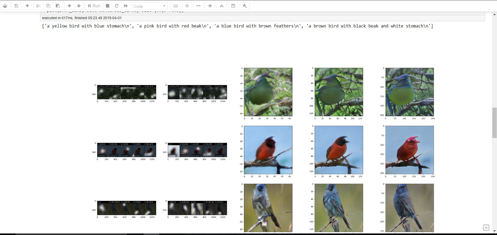
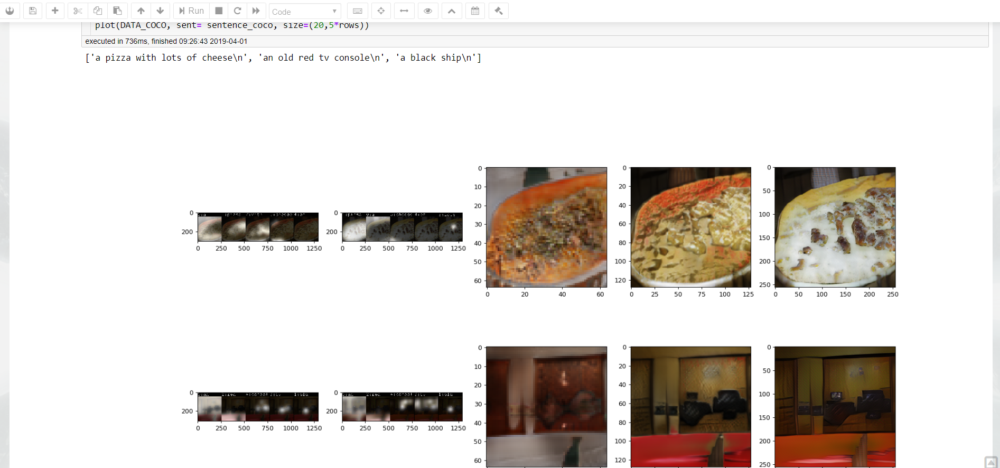
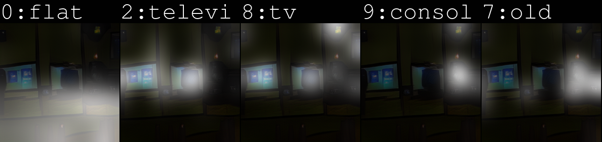
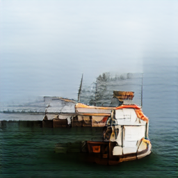
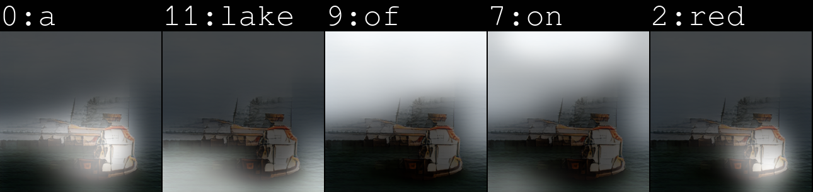
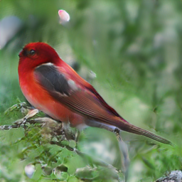
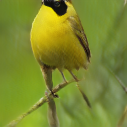
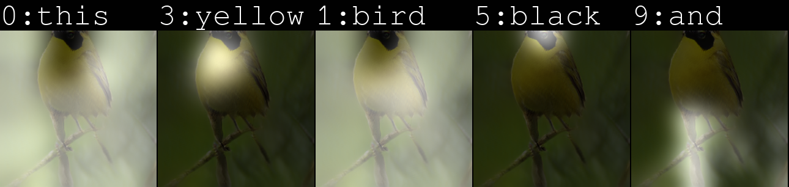

# Deep-Representation-of-Visual-Descriptions  
       
  
The aim of this project is about simplifying the concept of Attention mechanism in using it for generating images given some visual description for the images to be genrated.

## Why?  

## Documentation 
## Dependencies 
1. Python 3.0
2. Pytorch
3. torchfile
4. nltk- ('punkt')
5. pandas
6. scikit-learn
7. python-dateutil
8. easydict
9. shutil
10. Matplotlib
11. Scikit-Image(skimage)

## Data Download
### Repo : 

1. MS-COCO
This consists of `class_names = ['BG', 'person', 'bicycle', 'car', 'motorcycle', 'airplane',
               'bus', 'train', 'truck', 'boat', 'traffic light',
               'fire hydrant', 'stop sign', 'parking meter', 'bench', 'bird',
               'cat', 'dog', 'horse', 'sheep', 'cow', 'elephant', 'bear',
               'zebra', 'giraffe', 'backpack', 'umbrella', 'handbag', 'tie',
               'suitcase', 'frisbee', 'skis', 'snowboard', 'sports ball',
               'kite', 'baseball bat', 'baseball glove', 'skateboard',
               'surfboard', 'tennis racket', 'bottle', 'wine glass', 'cup',
               'fork', 'knife', 'spoon', 'bowl', 'banana', 'apple',
               'sandwich', 'orange', 'broccoli', 'carrot', 'hot dog', 'pizza',
               'donut', 'cake', 'chair', 'couch', 'potted plant', 'bed',
               'dining table', 'toilet', 'tv', 'laptop', 'mouse', 'remote',
               'keyboard', 'cell phone', 'microwave', 'oven', 'toaster',
               'sink', 'refrigerator', 'book', 'clock', 'vase', 'scissors',
               'teddy bear', 'hair drier', 'toothbrush']`
2. CUB_200_2011

## Models :

Model Architecture  :

### Trained models:
### Eval models

## Using Jupyter

[View Notebook](code/Driver!!.ipynb). This notebook uses the data and pretrained models to take in sentences from the user and provide the outputs.
#### BIRD GENERATED IMAGES

#### COCO GENERATED IMAGES

## Current Outputs

##### `Text : flat screen television on top of an old tv console`  

##### `Text : a large red and white boat floating on top of a lake`  

##### `TEXT :this bird is red and white in color with a stubby beak and red eye rings`  

##### `Text : this bird is yellow with black on its head and has a very short beak`  

##### Caption Generation with Attention:    

## Contributing :

## Website :
[https://ash1998.github.io/Deep-Representation-of-Visual-Descriptions/](https://ash1998.github.io/Deep-Representation-of-Visual-Descriptions/)
