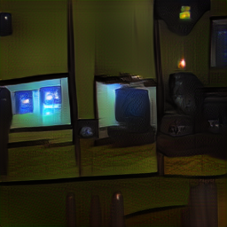
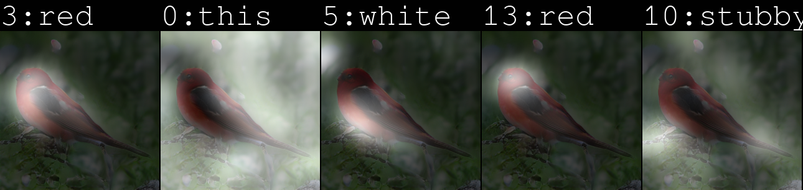

# Deep-Representation-of-Visual-Descriptions
     
`The project is ongoing, so changes will be frequent!!`

## Why? 

## Dependencies
1. Python
2. Pytorch
3. torchfile
4. nltk- ('punkt')
5. pandas
6. scikit-learn
7. python-dateutil
8. easydict

## Data Download

## Models :
### Trained models:
### Eval models

## Current Outputs

##### `Text : flat screen television on top of an old tv console`  

##### `Text : a large red and white boat floating on top of a lake`  

##### `TEXT :this bird is red and white in color with a stubby beak and red eye rings`  

##### `Text : this bird is yellow with black on its head and has a very short beak`  

##### Caption Generation with Attention:    

## Contributors

 Team Members    |            Github             |            LinkedIN
:-------------------------:|:-------------------------:|:-------------------------:     
Ashutosh Mishra `LEAD`|[ASH1998](https://github.com/ASH1998/)  |  [Ashutosh's LinkedIN](https://www.linkedin.com/in/ashutosh-mishra-a1ba01142/)      
V. Praveen|[praveenvoona](https://github.com/praveenvoonna) | [Praveen's LinkedIN](https://www.linkedin.com/in/praveenv-17)   
Deepak Kumar Behera|[Github]()|[LinkedIN]()
Madan Mohan Mohapatra|[Github]()|[LinkedIN]()

## Contributing :

## Website :
[https://ash1998.github.io/Deep-Representation-of-Visual-Descriptions/](https://ash1998.github.io/Deep-Representation-of-Visual-Descriptions/)
